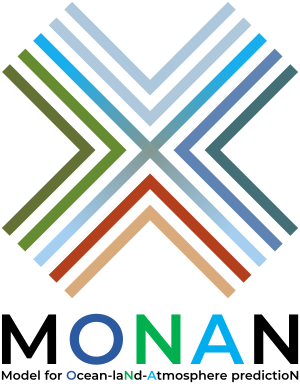
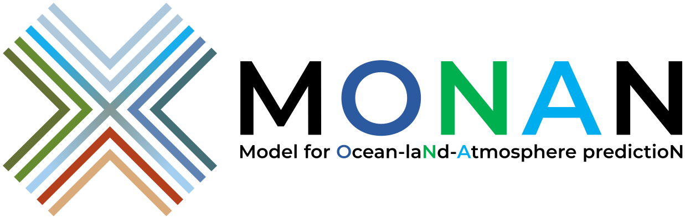

!!! warning "Página traducida con IA"

    Esta página fue traducida utilizando inteligencia artificial (IA). El contenido puede contener imprecisiones o interpretaciones erróneas. Para uso oficial o crítico, consulte al [administrador](mailto:mcstu.inpe@gmail.com) del sitio para confirmar la información.

# Logos

En esta página se encuentran algunas variaciones del logo desarrollado por [Luiz Flávio/INPE](http://lattes.cnpq.br/0199598825670421), para su uso en presentaciones y documentos relacionados con la divulgación del MONAN.

El nombre **MONAN** es el acrónimo de **Model for Ocean-laNd-Atmosphere predictioN**. Pero el nombre monan también tiene un significado: en resumen, [**tierra sin males**](https://pt.wikipedia.org/wiki/Mon%C3%A3). El logo, según Luiz Flávio, es un símbolo Tupi-Guaraní cuyo significado es la palabra **unión**. El logo presenta los colores principales que representan los componentes del sistema terrestre: el verde de los bosques y el marrón de la tierra y la arena sobre la superficie terrestre, el azul sobre la superficie oceánica y el cielo en sus diversos matices.

Para descargar, haz clic con el botón derecho del ratón sobre el logo y selecciona la opción "Guardar imagen como..." o "Save image as...".

Las imágenes vectoriales fueron realizadas con el programa Inkscape.

## Versiones en PNG horizontal

| Versión PNG Horizontal (100x32px)  | Versión PNG Horizontal Color (100x32px) |
| ------------- | ------------- |
|   |   |

| Versión PNG Horizontal (200x64px)  | Versión PNG Horizontal Color (200x64px) |
| ------------- | ------------- |
|   |   |

| Versión PNG Horizontal (300x96px)  | Versión PNG Horizontal Color (300x96px) |
| ------------- | ------------- |
|   |   |

| Versión PNG Horizontal (600x193px)  | Versión PNG Horizontal Color (600x193px) |
| ------------- | ------------- |
|   |   |

| Versión PNG Horizontal (1200x385px)  | Versión PNG Horizontal Color (1200x385px) |
| ------------- | ------------- |
|   |   |

## Versiones en PNG Vertical

| Versión PNG Vertical (100x128px)  | Versión PNG Vertical Color (100x128px) |
| ------------- | ------------- |
|   |   |

| Versión PNG Vertical (200x256px)  | Versión PNG Vertical Color (200x256px) |
| ------------- | ------------- |
|   |   |

| Versión PNG Vertical (300x384px)  | Versión PNG Vertical Color (300x384px) |
| ------------- | ------------- |
|   |   |

| Versión PNG Vertical (600x767px)  | Versión PNG Vertical Color (600x767px) |
| ------------- | ------------- |
|   |   |

| Versión PNG Vertical (1200x1535px)  | Versión PNG Vertical Color (1200x1535px) |
| ------------- | ------------- |
|   |   |

## Versiones en SVG

| Versión SVG Horizontal | Versión SVG Horizontal Color |
| ------------- | ------------- |
|   |   |

| Versión SVG Vertical | Versión SVG Vertical Color |
| ------------- | ------------- |
|   |   |
