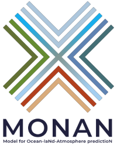
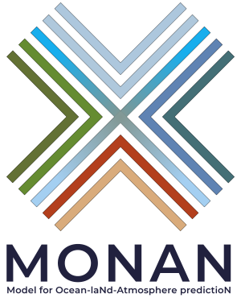

# Logos

Nesta página encontram-se algumas variações do logo desenvolvido pelo Luiz Flávio/INPE, para uso em apresentações e documentos pertinentes à divulgação do MONAN. 

O nome **MONAN** é o acrônimo para **Model for Ocean-laNd-Atmosphere predictioN**. Mas o nome monan possui um significado que é, em resumo, [**terra sem males**](https://pt.wikipedia.org/wiki/Mon%C3%A3). O logo, segundo Luiz Flávio, é um símbolo Tupi-Guarani cujo significado é a palavra **união**. O logo traz as cores principais que representam as componentes do sistema terrestre: o verde das matas e o marrom da terra e da areia sobre a superfície terrestre, o azul sobre a superfície oceânica e o céu em suas diversas tonalidades.

Para baixar, clique com o botão direito do mouse sobre o logo e selecione a opção "Salvar imagem como..." ou "Save image as...".

As imagens vetoriais foram feitas no programa Inkscape. 

## Versão PNG Horizontal (75x24px)

## Versão PNG Horizontal (100x32px)

## Versão PNG Horizontal (200x63px)

## Versão PNG Horizontal (300x95px)

## Versão PNG Horizontal (600x189px)

## Versão EPS Horizontal

## Versão PNG Vertical (75x93px)

## Versão PNG Vertical (100x124px)

## Versão PNG Vertical (200x347px)

## Versão PNG Vertical (300x370px)

## Versão PNG Vertical (600x740px)

## Versão EPS Vertical

