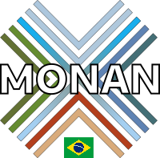

# Logos

Nesta página encontram-se algumas variações do logo desenvolvido pelo Luiz Flávio, para uso em apresentações e documentos pertinentes à divulgação do MONAN. 

A definição do nome do modelo **MONAN - Model for Ocean-laNd-Atmosphere predictioN**, cujo significado, em resumo, é **terra sem males**. O logo, segundo Luiz Flávio, é um símbolo Tupi-Guarani cujo significado é a palavra **união**. O logo traz as cores principais que representam as componentes do sistema terrestre: o verde das matas e o marrom da terra e da areia sobre a superfície terrestre, o azul sobre a superfície oceânica e o céu em suas diversas tonalidades.

Para baixar, clique com o botão direito do mouse sobre o logo e seleciona a opção "Salvar imagem como..." ou "Save image as...".

As imagens vetoriais foram feitas no programa Inkscape. 

## Versão Original (PNG, 75x75px)

## Versão Original Vetorial (SVG)

## Variação Vetorial (SVG)

## Versões Exportadas (PNG)

### Original Pequeno (100x100px, ~3dpi)

### Original Médio (200x200px, ~6dpi)

### Original Grande (300x300px, ~10dpi)

### Variação Pequena (100x100px, ~3dpi)

### Variação Média (200x200px, ~6dpi)

### Variação Grande (300x300px, ~10dpi)

