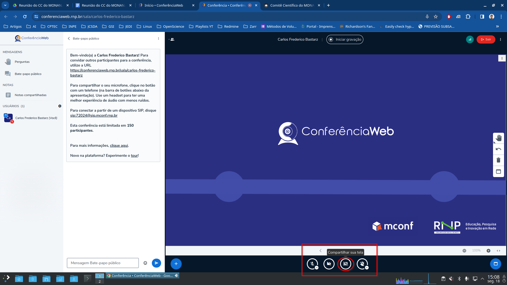
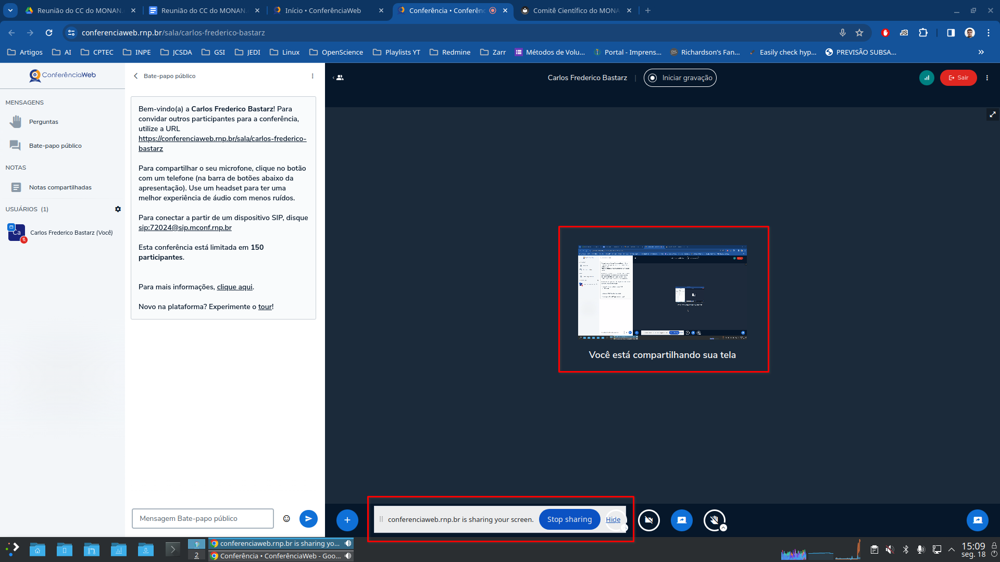

# Tutoriais

# Plataforma ConferênciaWEB RNP

Algumas instruções específicas sobre o uso da plataforma ConferênciaWeb da RNP, para os navegadores Mozilla Firefox e Google Chrome.

## Google Chrome

Para compartilhar a sua tela durante a reunião pelo navegador Google Chrome, observe as instruções a seguir:

1. Ao acessar a plataforma ConferênciaWeb, localize o botão `Compartilhar sua tela` na parte de baixo da sala:

    

2. Em seguida, um popup será aberto com as opções de tela para compartilhamento. Se você possuir múltiplos monitores ou várias janelas abertas, localize a janela que deseja compartilhar:

    

3. Finalmente, verifique que a sua tela está sendo compartilhada:

    

## Mozilla Firefox

Para compartilhar a sua tela durante a reunião pelo navegador Mozilla Firefox, observe as instruções a seguir:

1. Ao acessar a plataforma ConferênciaWeb, localize o botão `Compartilhar sua tela` na parte de baixo da sala (veja a imagem referente ao navegador Google Chrome);

2. Em seguida, um popup será aberto com as opções de tela para compartilhamento. Se você possuir múltiplos monitores ou várias janelas abertas, localize a janela que deseja compartilhar:

    
    
    

    **Nota:** clique nos menus do popup para encontrar a janela que você deseja compartilhar e clique em "Permitir".

3. Finalmente, verifique que a sua tela está sendo compartilhada:

    

## Referência

* [ConferênciaWeb RNP - Como usar?](https://conferenciaweb.rnp.br/#como_usar)
